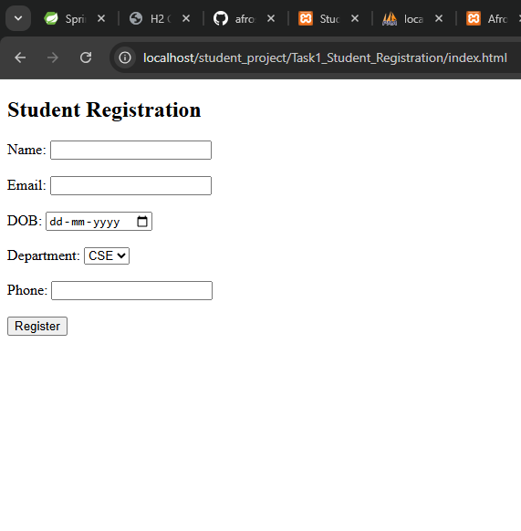
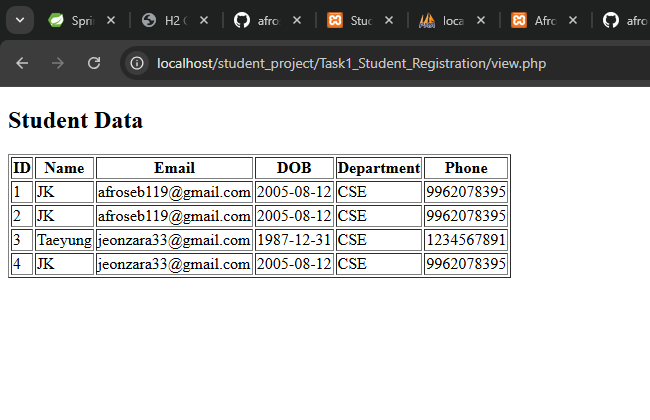

# Task 1: Student Registration System

## 📌 Description
A web application to register students and store their details in a database.

## 🔹 Features
- Add student details
- Store in MySQL database
- View student records

## 🔹 Technologies Used
- HTML
- PHP
- MySQL

## 🔹 How to Run
1. Start XAMPP
2. Open:

http://localhost/student_project/Task1_Student_Registration/index.html

## 📸 Output

