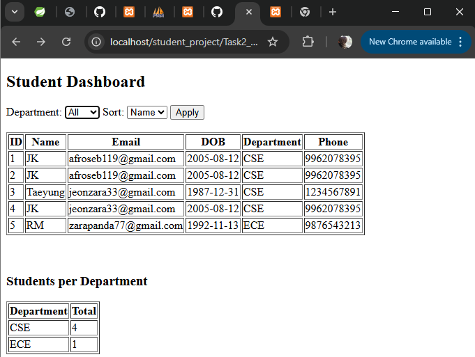

# Task 2: Data Retrieval & Sorting Dashboard

## 📌 Description
This dashboard displays student records with sorting, filtering, and counting features.

## 🔹 Features
- Sort students by Name and DOB
- Filter students by Department
- Count students per department

## 🔹 Technologies Used
- PHP
- MySQL
- HTML

## 🔹 How to Run
1. Start XAMPP (Apache + MySQL)
2. Open:

http://localhost/student_project/Task2_Student_Registration/dashboard.php

## 📸 Output

